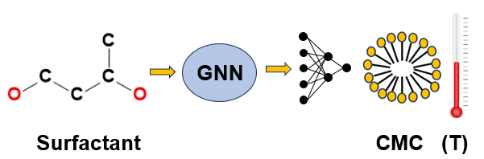

# Predicting the Temperature Dependence of Surfactant CMCs using Graph Neural Networks
This is the source code for the paper: [Predicting the Temperature Dependence of Surfactant CMCs Using Graph Neural Networks](https://pubs.acs.org/doi/10.1021/acs.jctc.4c00314)
# Graphical abstract


# Data
The test data set used in the **distinct surfactant split** is provided open-source. The rest of the data can be made available upon request.

# Code
* **model.py**: Python code for the GNN model to predict the temperature-dependent CMC of surfactants.
* **smiles_to_molecules.py**: Python code for generating molecular graphs from surfactant SMILES strings.
* **utils.py**: Helper functions.


# Citation

You can cite this work with the following .bib entry:
```
@Article{Brozos2024,
  author    = {Brozos, Christoforos and Rittig, Jan G. and Bhattacharya, Sandip and Akanny, Elie and Kohlmann, Christina and Mitsos, Alexander},
  journal   = {J. Chem. Theory Comput.},
  title     = {Predicting the Temperature Dependence of Surfactant CMCs Using Graph Neural Networks},
  year      = {2024},
  issn      = {1549-9618},
  month     = jun,
  comment   = {doi: 10.1021/acs.jctc.4c00314},
  doi       = {10.1021/acs.jctc.4c00314},
  publisher = {American Chemical Society},
  url       = {https://doi.org/10.1021/acs.jctc.4c00314},
}

```
