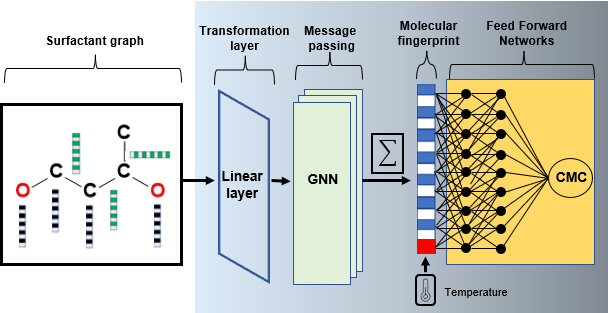

# Predicting the Temperature Dependence of Surfactant CMCs using Graph Neural Networks
This is the source code for the paper:
# Graphical abstract 

# Data
The test data set used in the **distinct surfactant split** is provided open-source. The rest of the data can be made available upon request.

# Code
* **model.py**: Python code for the GNN model to predict the temperature-dependent CMC of surfactants.
* **smiles_to_molecules.py**: Python code for generating molecular graphs from surfactant SMILES strings.
* **utils.py**: Helper functions.